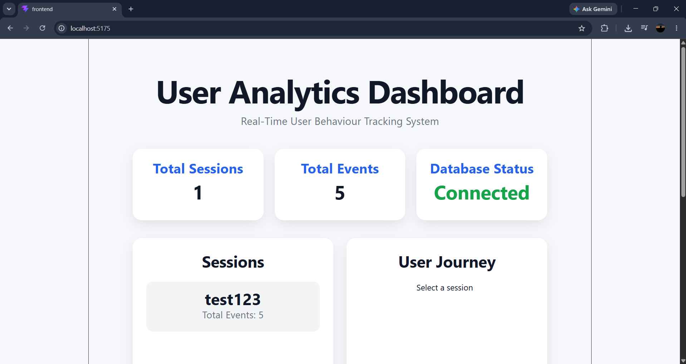
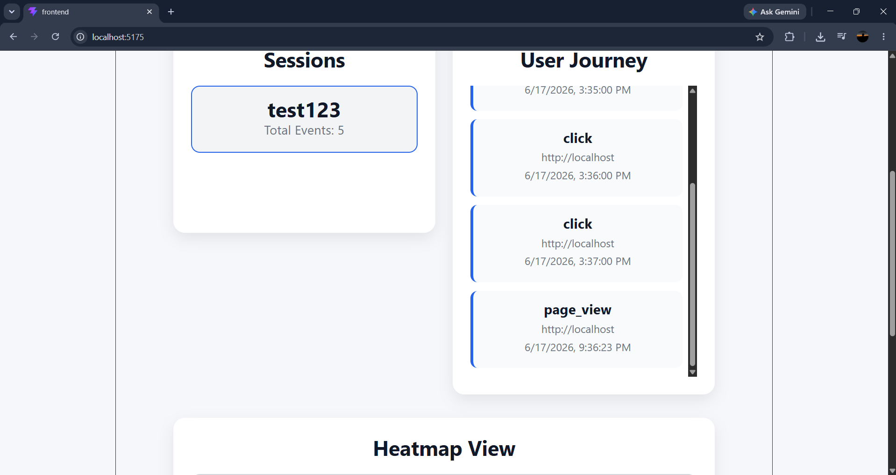
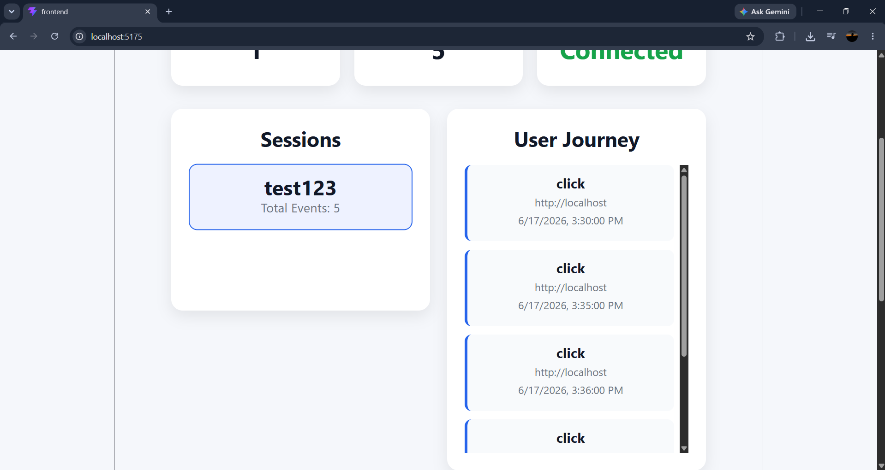
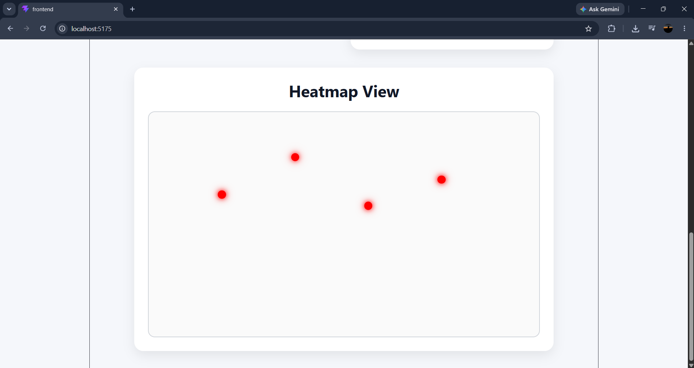

# User Analytics Dashboard

A full-stack User Analytics Dashboard developed as part of the CausalFunnel Full Stack Engineer assignment. The application tracks user interactions, stores analytics data in MongoDB, and provides visual insights through session analytics, user journey tracking, and click heatmap visualization.

---

## Features

* Session Analytics
* User Journey Visualization
* Click Heatmap
* MongoDB Event Storage
* REST APIs
* React Frontend
* Express Backend
* Responsive Dashboard UI

---

## Screenshots

### Dashboard Overview



### User Journey Analysis



### Additional User Journey View



### Click Heatmap



---

## Tech Stack

### Frontend

* React
* Axios
* CSS

### Backend

* Node.js
* Express.js
* MongoDB
* Mongoose

---

## API Endpoints

### Track Events

**POST** `/api/track`

Stores user interaction events.

### Sessions Analytics

**GET** `/api/sessions`

Returns session summaries.

### User Journey

**GET** `/api/sessions/:sessionId`

Returns events for a specific session.

### Heatmap Data

**GET** `/api/heatmap?url=<page_url>`

Returns click coordinates for heatmap visualization.

---

## Installation & Setup

### 1. Clone Repository

```bash
git clone https://github.com/ByteKnight03/causalfunnel-assignment.git
cd causalfunnel-assignment
```

### 2. Backend Setup

```bash
cd backend
npm install
npm start
```

### 3. Frontend Setup

```bash
cd frontend
npm install
npm run dev
```

### 4. Environment Variables

Create a `.env` file inside the `backend` folder and add:

```env
MONGO_URI=mongodb://127.0.0.1:27017/analytics
```

---

## Project Structure

```text
causalfunnel-assignment/
│
├── backend/
│   ├── models/
│   ├── routes/
│   ├── server.js
│   ├── package.json
│   └── .env.example
│
├── frontend/
│   ├── src/
│   ├── public/
│   └── package.json
│
├── screenshots/
│   ├── dashboard-home.png
│   ├── user-journey.png
│   ├── user-journey1.png
│   └── heatmap.png
│
├── README.md
└── .gitignore
```

---

## Assignment Objectives Completed

* Event Tracking
* Session Analytics
* User Journey Analysis
* Heatmap Visualization
* MongoDB Integration
* REST API Development
* Responsive Dashboard UI

---

## Author

**Shikhar Rastogi**

GitHub: https://github.com/ByteKnight03
